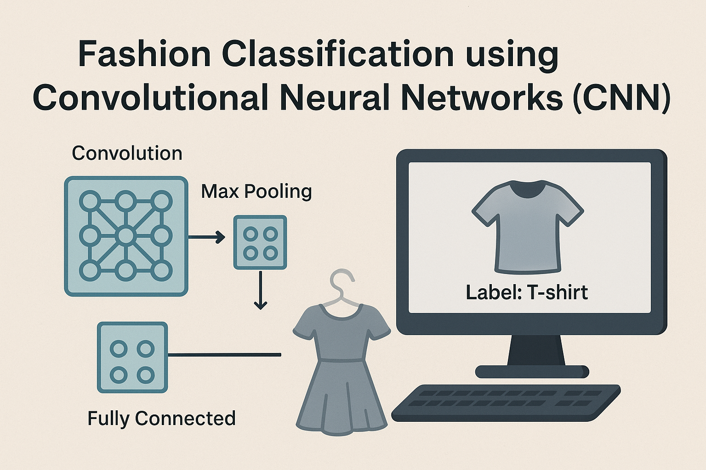

# Project: Fashion classification

# 👗 Fashion Classification Project

## 🎯 Project Goal
The goal of this project is to build a Convolutional Neural Network (CNN) to classify images of fashion items using the Fashion MNIST dataset provided by Keras.

---

## 📚 Data Source
- **Dataset**: Fashion MNIST  
- **Access**: Available through the Keras library (`keras.datasets.fashion_mnist`)  
- **Contents**: 60,000 grayscale images (28x28 pixels) across 10 clothing categories (e.g., T-shirt, Trouser, Sneaker, Bag, etc.)

---

## 🧠 Project Workflow

### 1. Load the Dataset
- Load the training and test sets from `keras.datasets.fashion_mnist`.

### 2. Preprocess the Images
- Resize images if needed (default is 28x28).
- Normalize pixel values to the range [0, 1].
- (Optional) Apply data augmentation (rotation, flipping, shifting, etc.).

### 3. Build the CNN Classification Model

### 4. Define Model Architecture
- **Input layer** matching the shape of the image.
- **Convolutional layers** to extract features.
- **MaxPooling layers** to reduce spatial dimensions.
- **Dropout layers** for regularization (prevent overfitting).
- **Dense layers** for classification.
- **Output layer** with `softmax` activation for multi-class classification.

### 5. Compile the Model
- Use `sparse_categorical_crossentropy` as the loss function.
- Use `Adam` optimizer.
- Track performance using `accuracy`.

### 6. Train the Model
- Fit the model on the training data.
- Use a validation set or validation split for monitoring.

### 7. Use Callbacks
- Use `ModelCheckpoint` to save the best version of the model based on validation accuracy/loss.
- Optionally use `EarlyStopping` to stop training when performance stops improving.

### 8. Evaluate the Model
- Evaluate model performance on the test set.

### 9. Make Predictions
- Predict class labels for new or test images.

### 10. Analyze and Visualize Results
- **Confusion Matrix**: Compare true vs. predicted labels.
- **Sample Predictions**: Visualize example classifications with images.

---
 [Home](README.md)
 
 [Contact](contact.md)
